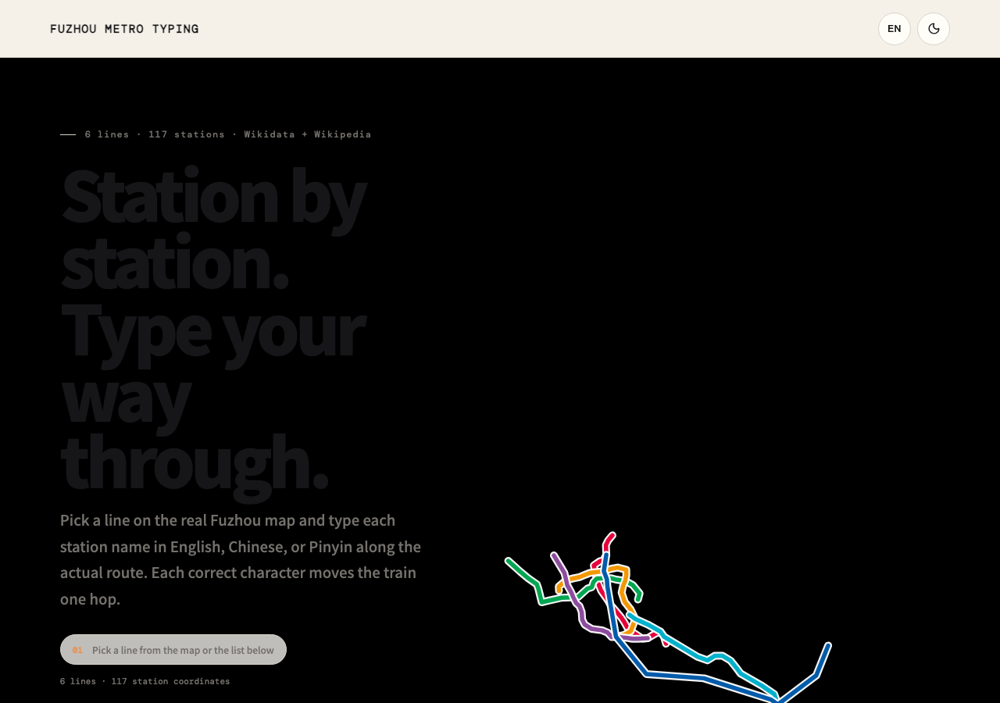
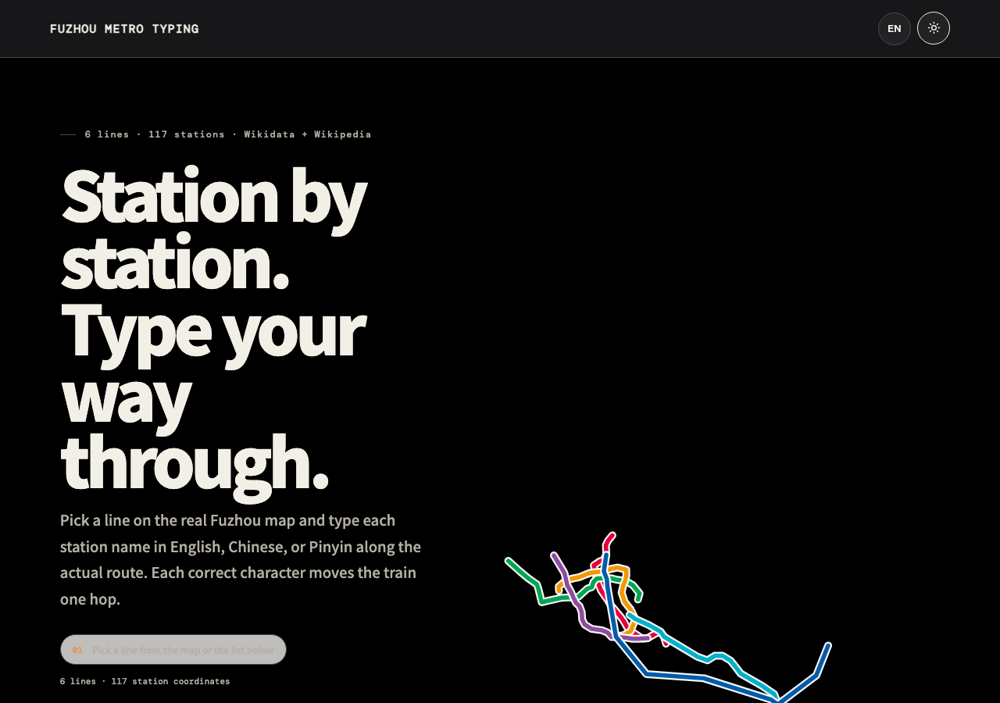
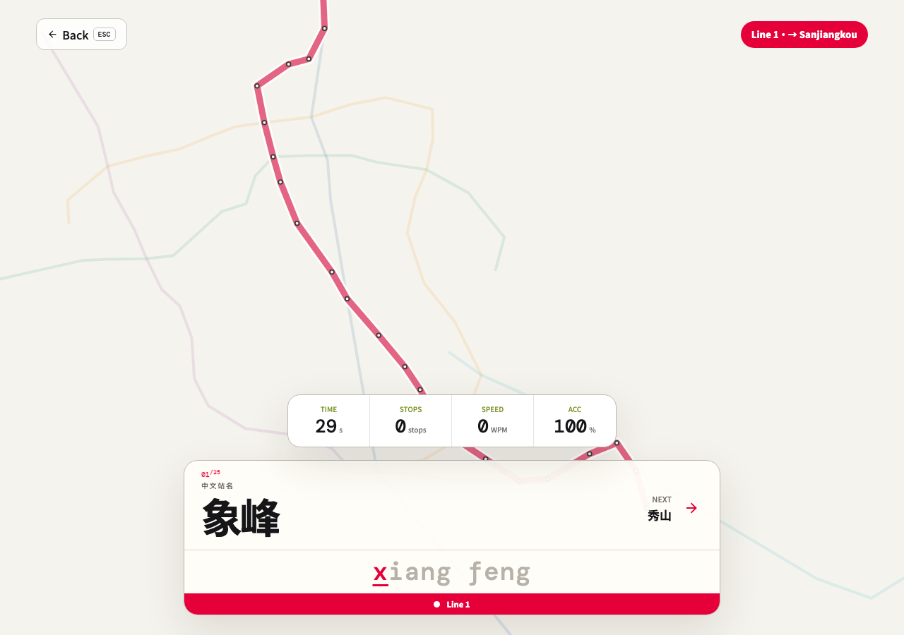
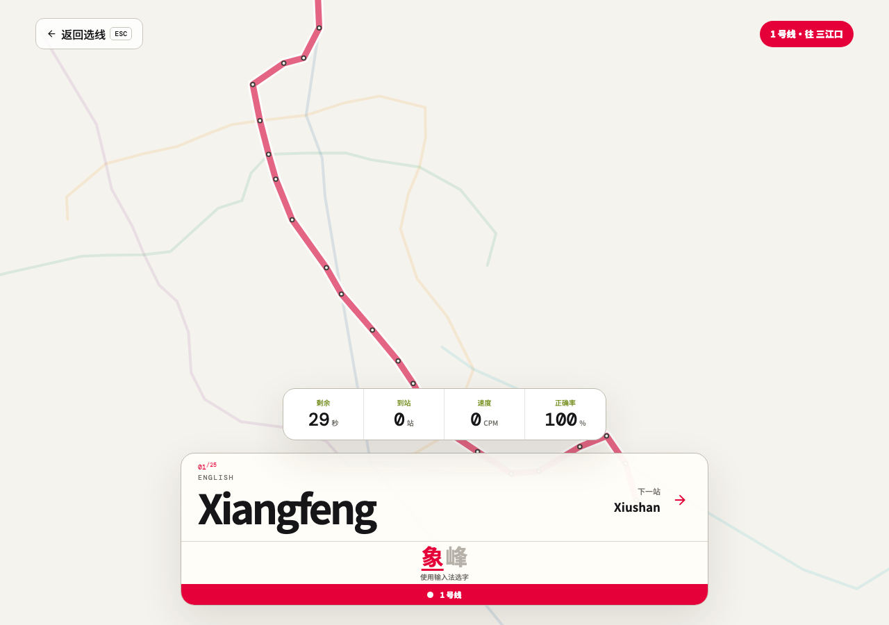

# FUZHOU METRO TYPING

<p align="center">
  
</p>

<p align="center">
  以 <strong>福州地铁真实站点</strong> 为题的中英文拼音打字练习。<br/>
  6 条线路 · 117 站 · 依 WGS84 经纬度绘制真实路径。
</p>

<p align="center">
  <a href="./LICENSE"></a>
  
  
  
  
</p>

---

## Preview

<table>
  <tr>
    <td width="50%"></td>
    <td width="50%"></td>
  </tr>
  <tr>
    <td></td>
    <td></td>
  </tr>
</table>

## 这是什么

- **一款打字练习工具**，不是「打字游戏」的营销皮。
- **题目来自真实运营数据** — 福州地铁 1 / 2 / 4 / 5 / 6 号线及滨海快线共 6 条线路的 117 个站点，坐标来自 Wikidata，站序来自 Wikipedia，拼音由 `pinyin-pro` 生成。
- **地图不是装饰** — 福州市行政区边界用 DataV.GeoAtlas 官方 GeoJSON，地铁路径按 WGS84 经纬度投影，站点位置对得上真实地理。
- **三语打字** — 英文逐字校验；中文支援桌面 / 手机输入法拼字选字（`compositionend` 事件）；拼音模式打小写拼音串（如 `dong jie kou`），连续打字或带空格均可。

## 玩法

1. 首页选一条地铁线路（默认展示全线，可点线路聚焦）
2. 选行驶方向（每条线有两个起讫方向）
3. 选模式：`30 秒快打` 或 `全线挑战`
4. 打字：正确一字，列车前进一段
5. 结束显示 WPM / CPM、正确率、完成站数

## 首次运行

```bash
bun install
bun run dev
# → http://127.0.0.1:5173

bun run build
bun run preview
```

## 技术

| Layer | Stack |
|---|---|
| Runtime | React 18 · Vite 6 |
| Style | 原生 CSS · CSS tokens · WCAG AA/AAA 焦点/对比检验 |
| Data | Wikidata (坐标) · Wikipedia (站序) · DataV.GeoAtlas (行政区) · pinyin-pro (拼音) · d3-geo · topojson-client |
| Test | node --test · Playwright E2E (`bun run test` · `bun run e2e`) |

## 数据

- **站点坐标**：[Wikidata](https://www.wikidata.org/wiki/Q1022261)（ODbL，Fuzhou Metro 条目下的线路 / 车站 / P625 坐标）
- **站序 / 英文名**：[Wikipedia 福州地铁车站列表](https://zh.wikipedia.org/wiki/%E7%A6%8F%E5%B7%9E%E5%9C%B0%E9%93%81%E8%BD%A6%E7%AB%99%E5%88%97%E8%A1%A8)
- **行政区边界**：[DataV.GeoAtlas 350100 福州市](https://datav.aliyun.com/portal/school/atlas/area_selector)（CC BY 4.0）
- **拼音**：`pinyin-pro`（MIT）

重新同步资料：

```bash
bun run data:build   # 重新抓取 Wikidata + Wikipedia 并生成 public/data/metro.json
```

## 数据源说明

福州地铁目前没有对等的官方开放 API（类似台湾 TDX）。本项目的站点坐标取自 Wikidata 的众包数据，站序取自 Wikipedia。已开通运营的 117 站均覆盖；未开通段（如 2 号线东延、6 号线东调段）按「无坐标 / 未开通」跳过，不计入题库。如坐标有偏差，欢迎在 Wikidata 修正或提 PR 校对。

## 致谢

本项目 fork 自 [tw-metro-typing](https://github.com/ridemountainpig/tw-metro-typing)（作者 Yen Cheng，MIT 许可）。福州市数据与地图投影在此之上做了完整替换。

## License

MIT © Yen Cheng (原 tw-metro-typing) · Fuzhou data integration © 2026 gandli
